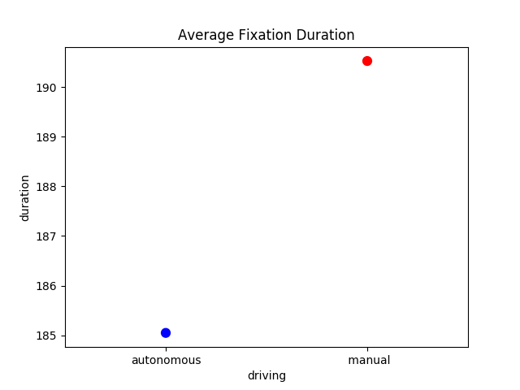
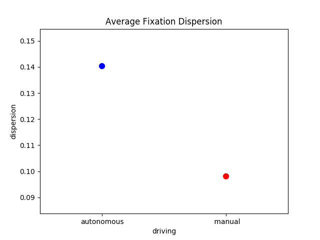
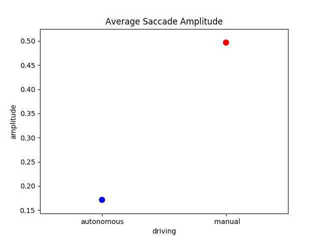
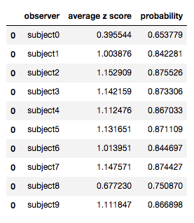
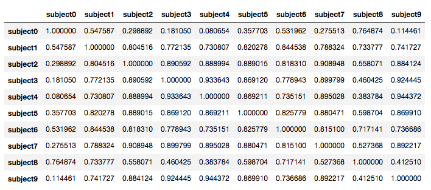
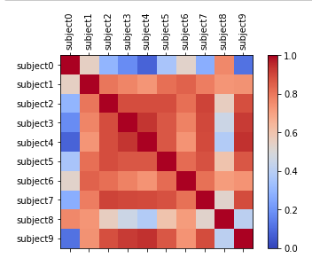

# Fixation and Saccade Analysis

## Fixation and Saccade Measurement Plots
To run: 
- navigate to the level that contains `report.py`
- run `python report.py` in command line

This will generate 3 plots: 
<ol> 
<li> Fixation Duration</li>
    Average fixation duration for autonomous vs manual for all subjects

<li> Fixation Dispersion </li>
 Average fixation dispersion for autonomous vs manual for all subjects

<li> Saccade Amplitude </li>
 Average saccade amplitude for autonomous vs manual for all subjects

</ol>

To add an additional subject's data: 
- After running preprocessing you should have 4 files per subject: a `fixations.csv` and an `pl_events.csv` for both autonomous and manual drivng types
- Open `fixation_files.csv`
- Add two entries with the filename, subject id number, and driving type (either autonomous or manual)
- Open  `event_files.csv` 
- Add two entries with the filename, subject id number, and driving type (either autonomous or manual)

Be careful to not add any spaces between column entries.

This can be repeated for any number of subjects. 

## Inter Observer Measurements
### Inter Observer Congruency (IOC)

Idea: Build a saliency map from all observers except the ith observer. To calculate degree of similarity between ith observer and others, calculate hit rate. Iterate over all subjects and average scores to get the IOC. 

### Pairwise Comparsion
To measure how much of a subject's fixations match with all other subjects'

1. Convert fixations to their locations in a grid
2. Since all the subjects have the same grid, the vectors being compared for each subject now all have the same length since each subject has one entry per grid position that contains the number of fixations at that position 
3. Calculate correlation between each subject 
4. Convert correlations to z-scores with Fisher Z-Transformation
5. Average z-scores 
6. Convert to probabilities

One can see these scores in a table.

One can also visualize the correlations between each subject with a table and a plot. 

